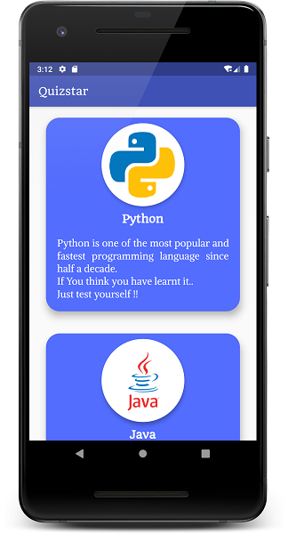
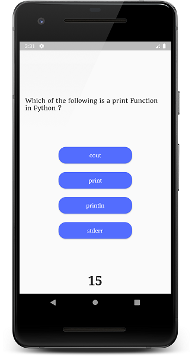
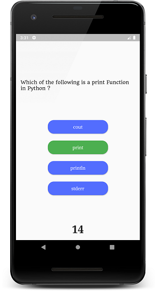
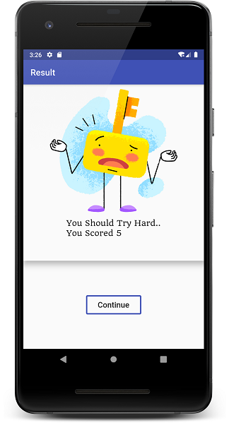

# Quizstar

This is a **Complete Quiz App in FLUTTER** using a lot of features such as
* Multiple Screens
* Timer (30 sec By Default)
* Button Color Changes On Click
* Result Page
* Questions From JSON

And a lot more...

## Watch The Complete Tutorial Here 

### [In English](https://youtu.be/yHrpx4PoBzU)
### [In Hindi](https://youtu.be/tJob-xdGLXE)

### Star It And Play With The Code

## Here Are A Few Screenshots From The App

## **Changelog/Commit 01**

  1. Updated Descriptions
  2. Added JSON Files to Open for Diffrent Cards / Languages
  3. Fixed The Code for Checking Answers..

## **Changelog/Commit 02**

  *Coming SOON*